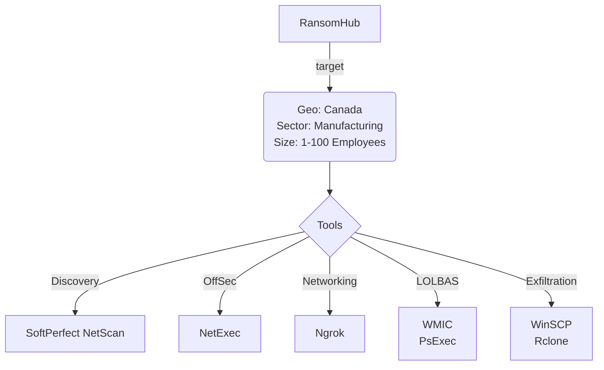

# Community Report 006 - RansomHub February 2025

### Contributor Details

- Real Name: N/A
- Online Handle / Links to profiles: https://x.com/SecurityAura
- Employer: Private, DFIR role
- Affiliations: Curated Intelligence

---
### Adversary

- Named adversary: RansomHub

---
### Incident Details

- Time of Incident: February 2025
- Victim Sector: Manufacturing
- Victim Country: Canada
- Victim Size: 1-100

---
### Observed Tools
 
| Discovery | RMM Tools | Defense Evasion | Credential Theft | OffSec | Networking | LOLBAS | Exfiltration |
|---|---|---|---|---|---|---|---|
| SoftPerfect Network Scanner |  |  |  | NetExec (nxc) | ngrok | WMIC | WinSCP |
| |  |  |  |  |  | PsExec | rclone |
---
#### Any Related Sources

| Date Published | Report |
|---|---|
| N/A | N/A |

---
#### Summary Diagram

