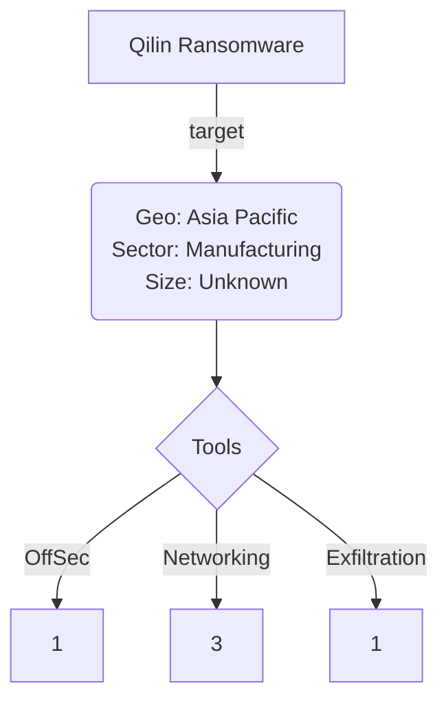

# Community Report 0013 - Qilin June 2022
### Contributor Details

- Real Name: N/A
- Online Handle / Links to profiles: @knappresearchlb
- Employer: Private, Threat Intelligence Lead
- Affiliations: Ransom-ISAC

---
### Adversary

- Named adversary: Qilin Ransomware

---
### Incident Details

- Time of Incident: April 2023
- Victim Sector: Manufacturing
- Victim Country: Asia Pacific
- Victim Size: Unknown
- Victim Name: Unknown

---
### Observed Tools

| Discovery | RMM Tools | Defense Evasion | Credential Theft | OffSec | Networking | LOLBAS | Exfiltration |
|---|---|---|---|---|---|---|---|
| | | | | Cobalt Strike | Used SMB, RDP, WMI for lateral movement in network| | MEGA cloud storage (30GB)|

---

### Indicators of Compromise (IOCs)

| Indicator       | Description                                                           |
| --------------- | ---------------------------------------------------------------- |
|  184.168.123.0/24  |  Repeated connections over the HTTP and SSL protocol to multiple newly observed IPs located in the 184.168.123.0/24 range were observed, indicating C2 connectivity.   |

#### Any Related Sources

- 

| Date Published | Report |
|---|---|
| 4/7/2024 |  https://www.darktrace.com/blog/a-busy-agenda-darktraces-detection-of-qilin-ransomware-as-a-service-operator |
|   | |

