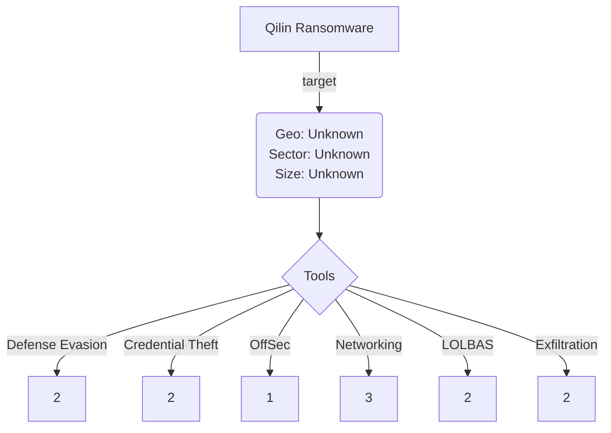

# Community Report 0015 - BlackSuit April 2024
### Contributor Details

- Real Name: N/A
- Online Handle / Links to profiles: @knappresearchlb
- Employer: Private, Threat Intelligence Lead
- Affiliations: Ransom-ISAC

---
### Adversary

- Named adversary: BlackSuit Ransomware

---
### Incident Details

- Time of Incident: April 2024
- Victim Sector: Unknown 
- Victim Country: Unknown
- Victim Size: Unknown
- Victim Name: Unknown

---
### Observed Tools

| Discovery | RMM Tools | Defense Evasion | Credential Theft | OffSec | Networking | LOLBAS | Exfiltration |
|---|---|---|---|---|---|---|---
|          |              |     Windows VM - the threat actor set up a Windows virtual machine (VM) by installing VirtualBox and downloading a virtual machine file.          |                           | Rubeus - Kerberoasting |   Server Message Block (SMB)        |     PSExec - The threat actor used PsExec from their VM to copy the ransomware payload —which was hosted on a network share—to hundreds of hosts through Server Message Block (SMB)      |    7-Zip - 7zip was used to locally stage and compress data from connected network shares     |
|                   |              |      Valid Accounts - used to access the environement via the corporate VPN         |           Rubeus - Kerberoasting               |   |   FTP -  Windows server began initiating FTP connections to an external IP address, sending over 100GB of data over the next six hours.      |            |    WinSCP - WinSCP was used to facilitate the FTP connection.     |
|                  |              |               |            ntdsutil - Used to dump the NTDS.DIT file from several domain controllers     |   |  WMIC was used to load the ransomware payload as a library, thus executing the encryptor.       |     WMIC was used to load the ransomware payload as a library, thus executing the encryptor.       |          |
|                 |              |               |                  |    |         |     PowerShell -   The attacker then downloaded a custom payload that allowed them to load Rubeus, a toolkit for Kerberos abuse, into PowerShell, rather than ingress a compiled binary.     |          |
|                   |              |               |                           |            |            |          |
---

### Indicators of Compromise (IOCs)

| Indicator       | Description                                                           |
| --------------- | ---------------------------------------------------------------- |
| start PsExec.exe --accepteula @C:\share$\hosts1.txt cmd /c COPY “\\server\share$\payload.dll” "C:\**** | The threat actor used PsExec from their VM to copy the ransomware payload—which was hosted on a network share—to hundreds of hosts through Server Message Block (SMB).  |
| WMIC /node:"X.X.X.X" process call create 'cmd.exe /c regsvr32.exe /n /I:"-id \"<UNIQUE_STRING>\" -ep 70" "C:\****payload.dll"' | Following the previous indicator command, WMIC was used to load the ransomware payload as a library, thus executing the encryptor.  |
| ntdsutil "ac in ntds" "ifm" "cr fu C:\Users\Public" q q | One of the users compromised via Kerberoasting, “admin1,” was a domain administrator; the attacker used this account to dump the NTDS.DIT file from several domain controllers via ntdsutil, leading to the compromise of the forest.  |

#### Any Related Sources

- 

| Date Published | Report |
|---|---|
| 28/05/2024 |  [https://www.darktrace.com/blog/a-busy-agenda-darktraces-detection-of-qilin-ransomware-as-a-service-operator](https://reliaquest.com/blog/blacksuit-attack-analysis/) |
|   | |

