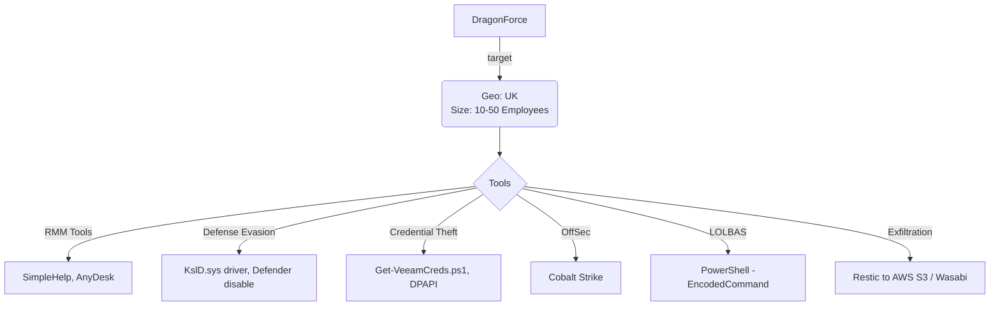

# Community Report Template 021 - DragonForce April 2025

### Contributor Details

- Real Name: N/A
- Online Handle / Links to profiles: Discord ap_2600
- Employer: Private, DFIR role
- Affiliations: Curated Intelligence, Ransom-ISAC

---
### Adversary

- Named adversary: DragonForce

---
### Incident Details

- Time of Incident: April 2025
- Victim Country: UK
- Victim Size: 10-50

---
### Observed Tools
 
| Discovery | RMM Tools | Defense Evasion | Credential Theft | OffSec | Networking | LOLBAS | Exfiltration |
|---|---|---|---|---|---|---|---|
|  | SimpleHelp | KslD.sys (BYOVD) | Get-VeeamCreds.ps1 | Cobalt Strike |  | PowerShell (-EncodedCommand) | Restic |
|  | AnyDesk | Windows Defender Real-time Protection disabled |  |  |  |  | AWS S3 bucket (wasabisys) |

---
### Indicators of Compromise (IOCs)

```
File IOCs (MD5):
- AnyDesk.exe                 871eb4b8aefaea1113dd3f08b7cb535c
- SimpleService.exe           73c6073e23de262b60104cccaa56f4f7
- elev_win.exe                8ffac369064a72a36a120c856f502e5d
- KslD.sys                    eec4e720725b4bfc8568d889d64066ee
- winupdate.exe (Restic)      782ea34eb952fe6d73d7a21e172ac291

IP Addresses:
- 179[.]60.146.40  - Threat Actor C2 (NL), hostname "WIN-VHVV7IAS6MH" - Cobalt Strike
- 91[.]191.209.110 - Threat Actor AnyDesk origin (Sofia, BG), hostname "WIN-4GBGHJII4DG"

Filenames / Paths:
- C:\PerfLogs\win.exe                                    (ransomware encryptor)
- C:\PerfLogs\AnyDesk.exe
- C:\ProgramData\SimpleHelp\ElevateSH\SimpleService.exe
- C:\Users\admin\AppData\Roaming\AnyDesk\ad.trace
- C:\Users\Public\Documents\new.txt                      (exfil file list)
- C:\windows\system32\winupdate.exe                      (renamed Restic)
- system32\drivers\wd\KslD.sys                           (driver for evasion)

Ransomware Note:
- Filename: readme.txt
- Leak blog (TOR): http://z3wqngtxft7id3ibr7srivv5gjof5fwg76slewnzwwakjuf3nlhukdid.onion
- Negotiation portal (TOR): http://3pktcrcbmssvrnwe5skburdwe2h3v6lbdnn5kbjqihsg6eu6s6b7ryqd.onion

Notable Commands:
- powershell.exe -EncodedCommand <base64>   (GetVeeamCreds, DPAPI Unprotect of Veeam SQL creds)
- winupdate.exe init                         (Restic init against S3 wasabisys)
```

---
#### Any Related Sources

| Date Published | Report |
|---|---|
| 28 January 2025 | https://www.bleepingcomputer.com/news/security/hackers-exploiting-flaws-in-simplehelp-rmm-to-breach-networks/ |
| 30 October 2025 | https://zensec.co.uk/blog/how-rmm-abuse-fuelled-medusa-dragonforce-attacks/ |
| N/A | https://github.com/sadshade/veeam-creds/tree/main |
| N/A | https://www.huntress.com/blog/using-backup-utilities-for-data-exfiltration |

---
#### Summary Diagram


