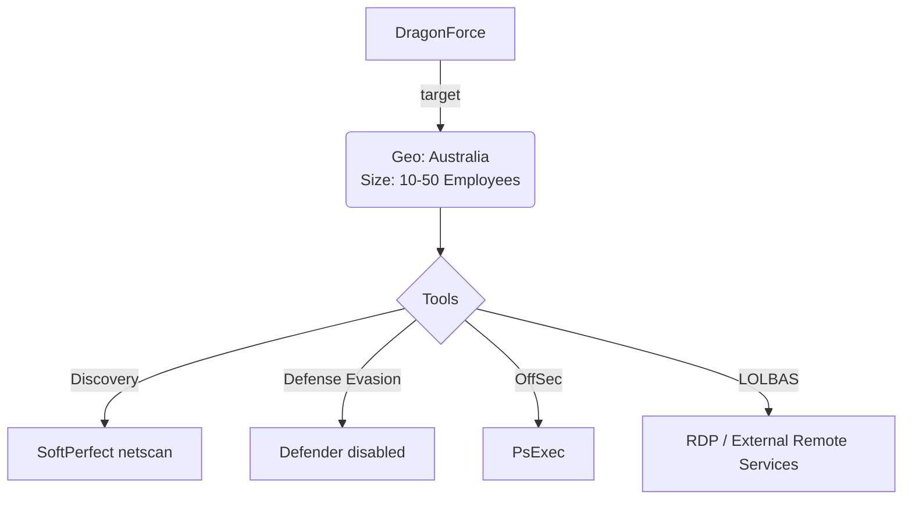

# Community Report Template 022 - DragonForce February 2026

### Contributor Details

- Real Name: N/A
- Online Handle / Links to profiles: Discord ap_2600
- Employer: Private, DFIR role
- Affiliations: Curated Intelligence, Ransom-ISAC

---
### Adversary

- Named adversary: DragonForce

---
### Incident Details

- Time of Incident: February 2026
- Victim Country: Australia
- Victim Size: 10-50

---
### Observed Tools
 
| Discovery | RMM Tools | Defense Evasion | Credential Theft | OffSec | Networking | LOLBAS | Exfiltration |
|---|---|---|---|---|---|---|---|
| SoftPerfect netscan |  | Windows Defender Real-time Protection disabled |  | PsExec (PSEXESVC.exe) |  | RDP (External Remote Services) |  |

---
### Indicators of Compromise (IOCs)

```
IP Addresses:
- 91.215.85.8    - RU - Prospero Ooo (AS200593) - initial RDP source
- 91.202.233.99  - TM - Prospero Ooo (AS200593) - RDP source
- 91.92.242.176  - NL - Omegatech LTD (AS202412) - RDP source

Filenames / Paths:
- C:\Users\REDACTED\Desktop\App\netscan.exe         (SoftPerfect netscan - network discovery)
- C:\Users\REDACTED\Desktop\df.exe                  (DragonForce payload)
- C:\Users\REDACTED\Documents\df.exe                (DragonForce payload)
- %SystemRoot%\PSEXESVC.exe                       (PsExec service for lateral movement)

Defender Signature:
- Ransom:Win32/DragonForce.C!MTB

Notable Behaviour:
- Initial Access via public-facing RDP (TA0001/T1133)
- PsExec lateral movement (T1021.002)
- Internal RDP lateral movement (T1021.001)
```

---
#### Any Related Sources

| Date Published | Report |
|---|---|
| N/A | https://www.softperfect.com/products/networkscanner/ |

---
#### Summary Diagram


