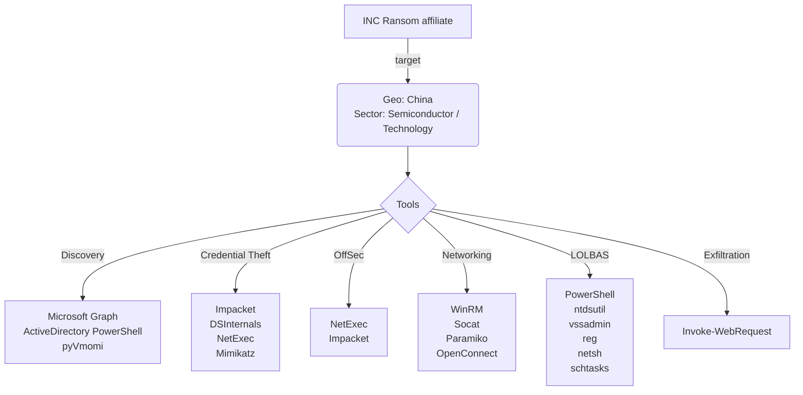

# Community Report Template 024 - INC Ransom July 2026

### Contributor Details

- Real Name: Josh Allman
- Online Handle / Links to profiles: @xorJosh
- Employer: Independent threat intelligence research
- Affiliations: [Ctrl-Alt-Intel](https://ctrlaltintel.com/)

---
### Adversary

- Named adversary: INC Ransom affiliate

---
### Incident Details

- Time of Incident: July 2026
- Victim Country: China
- Victim Sector: Technology
- Victim Size: Unknown

---
### Observed Tools

| Discovery | RMM Tools | Defense Evasion | Credential Theft | OffSec | Networking | LOLBAS | Exfiltration |
|---|---|---|---|---|---|---|---|
| Microsoft Graph API |  |  | Impacket `secretsdump.py` | NetExec | WinRM / `pywinrm` | PowerShell | `Invoke-WebRequest` |
| ActiveDirectory PowerShell module |  |  | DSInternals | Impacket | Socat | `cmd.exe` | Microsoft Graph API |
| `pyVmomi` vShere Python module |  |  | NetExec  |  | Paramiko | `ntdsutil.exe` |  |
|  |  |  | Mimikatz |  | OpenConnect | `vssadmin.exe` |  |
|  |  |  | Windows DPAPI |  | SMB | `reg.exe` |  |
|  |  |  | Veeam PowerShell module |  |  | `net.exe` |  |
|  |  |  |  |  |  | `netsh.exe` |  |
|  |  |  |  |  |  | `schtasks.exe` |  |
|  |  |  |  |  |  | `tasklist.exe` |  |
|  |  |  |  |  |  | `ipconfig.exe` |  |
|  |  |  |  |  |  | `route.exe` |  |
|  |  |  |  |  |  | `arp.exe` |  |
|  |  |  |  |  |  | `nltest.exe` |  |
|  |  |  |  |  |  | `cmdkey.exe` |  |
|  |  |  |  |  |  | WMI / `Get-WmiObject` |  |


---
### Indicators of Compromise (IOCs)

```text
Network:
- 213.176.114[.]6          INC affiliate C2, staging, and exfiltration host

Host:
- C:\Windows\Temp\locker.exe
- C:\Windows\Temp\go.bat
- Scheduled task: WinUpdate
- Firewall rules: TunnelPorts, HTTP9999
- Ransom note: INC-README.txt
- Encrypted extension: .INC

SHA-256:
- ef394149c8da3af730c37d550027df8639a3aaa6feaccea60112461ae6955829  Windows INC encryptor
- 753207ad5e72ddc6b13889132e5de18836b1a2acf954443655fea82b430e4c99  ESXi INC encryptor
- 0206a670243efa0f736e3725c4c7c8879b262cb07af47a8dcfa18bc9787cc1bd  Multi-platform payload archive

Notable Commands:

# Credential Theft

C:\Users\Public\mimi.exe "privilege::debug" "sekurlsa::logonpasswords" "exit" 

# Ransomware deployment via scheduled tasks; runs locker.exe

schtasks /create /tn "WinUpdate" /tr "C:\Windows\Temp\go.bat" /sc once /st 00:00 /ru <account> /rp <password> /rl highest /f 
- C:\Windows\Temp\locker.exe --mode fast --dir <drive>:\
```

---
#### Any Related Sources

| Date Published | Report |
|---|---|
| 22 July 2026 | [Ctrl-Alt-Intel - INC ransomware targets NAS devices, leveraging AI for operations](https://ctrlaltintel.com/research/INC-Ransom/) |

---
#### Summary Diagram


