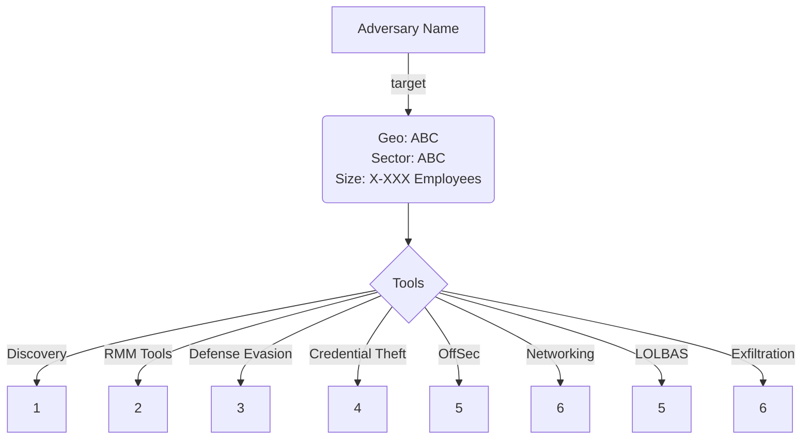

# Community Report Template
- Please copy the template, add your information to the following fields
- Use a naming scheme like `CR-001-AKIRA-JUN-2025.md` of your file
> [!NOTE]
> The level of detail provided is the contributor's choice. The more verifiable information shared, the increased level of reliability and credibility.
### Contributor Details
```
- Real Name
- Online Handle / Links to profiles e.g. X/Twitter, BlueSky, or LinkedIn
- Employer / Affiliations e.g. Trust Groups, ISACs, etc
```
---
### Adversary
```
- Named adversary (e.g. Qilin, Akira, etc)
- Unknown adversary (e.g. no ransomware deployed by highly likely to be a ransomware affiliate or initial access broker)
```
---
### Incident Details
```
- Time of Incident (e.g. January 2025)
- Victim Sector (e.g. Retails, Manufacturing, Legal, Healthcare)
- Victim Country (e.g. US, UK, Canada, France, Italy)
- Victim Size (e.g. Number of employees is 10-100, 100-1,000, 1,000-10,000, 10,000+)
```
---
### Observed Tools
- Use the [RTM categories](https://github.com/BushidoUK/Ransomware-Tool-Matrix/tree/main/Tools) as a guide of where to list tools in the table below
 
| Discovery | RMM Tools | Defense Evasion | Credential Theft | OffSec | Networking | LOLBAS | Exfiltration |
|---|---|---|---|---|---|---|---|
| 1 | 2 | 3 | 4 | 5 | 6 | 7 | 8 |
---
### Indicators of Compromise (IOCs)
```
- Use this section to share any IOCs (Domains, Hashes, IPs, URLs), FileNames, Commands, Scripts, or Process Trees.
```
---
#### Any Related Sources
- e.g. VirusTotal Collections, AnyRun Sandbox Detonations, etc

| Date Published | Report |
|---|---|
| DD Month YYYY | https:// |

---
#### Summary Diagram
- Add Adversary Name
- Add Targeting Info (if any)
- Only include types of Tools used and remove categories with none observed


