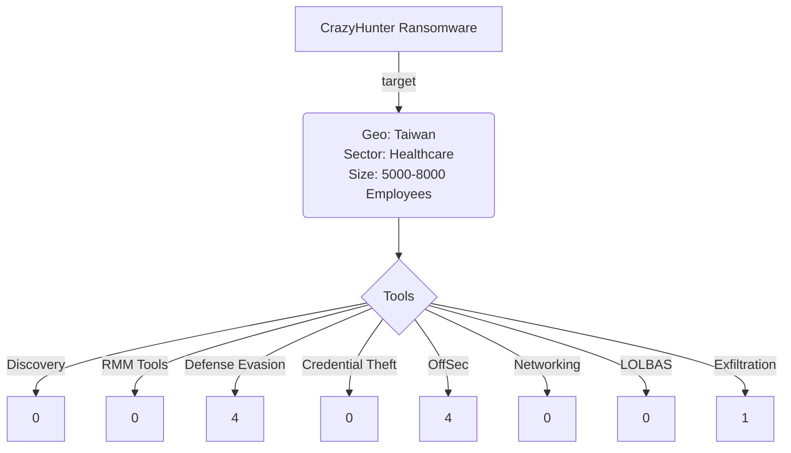

# Community Report 011 - CrazyHunter March 2025
### Contributor Details

- Real Name: N/A
- Online Handle / Links to profiles: @knappresearchlb
- Employer: Private, Threat Intelligence Lead
- Affiliations: Ransom-ISAC

---
### Adversary

- Named adversary: CrazyHunter Ransomware

---
### Incident Details

- Time of Incident: February 2025
- Victim Sector: Healthcare
- Victim Country: Taiwan
- Victim Size: 1000-10000
- Victim Name: Mackay Memorial Hospital

---
### Observed Tools

| Discovery | RMM Tools | Defense Evasion | Credential Theft | OffSec | Networking | LOLBAS | Exfiltration |
|---|---|---|---|---|---|---|---|
|  |  | (zam64.sys) vulnerable Zemana Anti-Logger kernel driver |  |	SharpGPOAbuse  |  |  | file.exe - a tool capable of hosting/setting up the victim’s machine as a file server or to monitor for files with specific extensions in the specified directory. Based on its capabilities, it is almost certain that this tool is used for data exfiltration |
|  |  | go.exe (malware written in Go programming language designed to load a vulnerable version of Zemana Anti-Logger kernel driver, zam64.sys) |  | Prince Ransomware |  |  |  |
|  |  | go2.exe (malware written in Go programming language designed to load a vulnerable version of Zemana Anti-Logger kernel driver, zam64.sys) |  |   Donut - a tool that generates shellcode from PE files |  |  |  |
|  |  |  av-1m.exe - an AV bypass tool	|  |bb.exe - a shellcode loader which loaded crazyhunter.sys |  |  |  |

---

### Indicators of Compromise (IOCs)

| File Name       | Sha256                                                           |
| --------------- | ---------------------------------------------------------------- |
| bb.exe          | 2cc975fdb21f6dd20775aa52c7b3db6866c50761e22338b08ffc7f7748b2acaa |
| crazyhunter.exe | f72c03d37db77e8c6959b293ce81d009bf1c85f7d3bdaa4f873d3241833c146b |
| crazyhunter.sys | 5316060745271723c9934047155dae95a3920cb6343ca08c93531e1c235861ba |
| file.exe        | 14359f54d49799c713c2a8cc0c19a88392a0c6ad2c383494023008326cd0ba15 |
| go.exe          | 754d5c0c494099b72c050e745dde45ee4f6195c1f559a0f3a0fddba353004db6 |
| go2.exe         | 983f5346756d61fec35df3e6e773ff43973eb96aabaa8094dcbfb5ca17821c81 |
| go3.exe         | f72c03d37db77e8c6959b293ce81d009bf1c85f7d3bdaa4f873d3241833c146b |
| gpo.exe         | 512f785d3c2a787b30fa760a153723d02090c0812d01bb519b670ecfc9780d93 |
| ru.bat          | d1081c77f37d080b4e8ecf6325d79e6666572d8ac96598fe65f9630dda6ec1ec |
| zam64.sys       | 2bbc6b9dd5e6d0327250b32305be20c89b19b56d33a096522ee33f22d8c82ff1 |
| bb2.zip         | bdfc66266a2a19fc3d5dccef3eefe4c0ee928ba5b7abad60bc320218b2082fea |

#### Any Related Sources

- CrazyHunter: The Rising Threat of Open-Source Ransomware
- Donut OST -  https://github.com/TheWover/donut/tree/master
- SharpGPOAbuse - https://github.com/FSecureLABS/SharpGPOAbuse

| Date Published | Report |
|---|---|
| 31/03/2025 | https://labs.withsecure.com/publications/crazyhunter-ransomware|
|   | |

