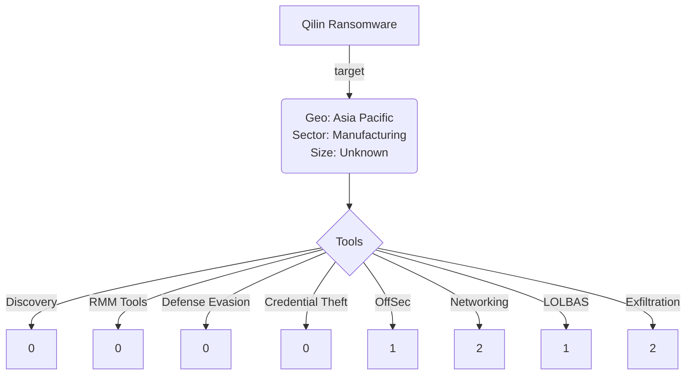

# Community Report 0014 - Qilin May 2024
### Contributor Details

- Real Name: N/A
- Online Handle / Links to profiles: @knappresearchlb
- Employer: Private, Threat Intelligence Lead
- Affiliations: Ransom-ISAC

---
### Adversary

- Named adversary: Qilin Ransomware

---
### Incident Details

- Time of Incident: May 2024
- Victim Sector: Unknown 
- Victim Country: USA
- Victim Size: Unknown
- Victim Name: Unknown

---
### Observed Tools

| Discovery | RMM Tools | Defense Evasion | Credential Theft | OffSec | Networking | LOLBAS | Exfiltration |
|---|---|---|---|---|---|---|---|
| | | | | Cobalt Strike - (HTTP/SSL traffic linked to Cobalt Strike, including PowerShell request for sihost64.dll) | lateral movement via DCE-RPC and RDP | PowerShell | FTP (102GB)|
|||||||| HTTP/S (783GB) |

---

### Indicators of Compromise (IOCs)

| Indicator       | Description                                                           |
| --------------- | ---------------------------------------------------------------- |
|  194.165.16[.]13 | Large amount of data exfiltrated via FTP and other channels to rare external endpoint (194.165.16[.]13)  |
|  ||

#### Any Related Sources

- 

| Date Published | Report |
|---|---|
| 4/7/2024 |  https://www.darktrace.com/blog/a-busy-agenda-darktraces-detection-of-qilin-ransomware-as-a-service-operator |
|   | |

